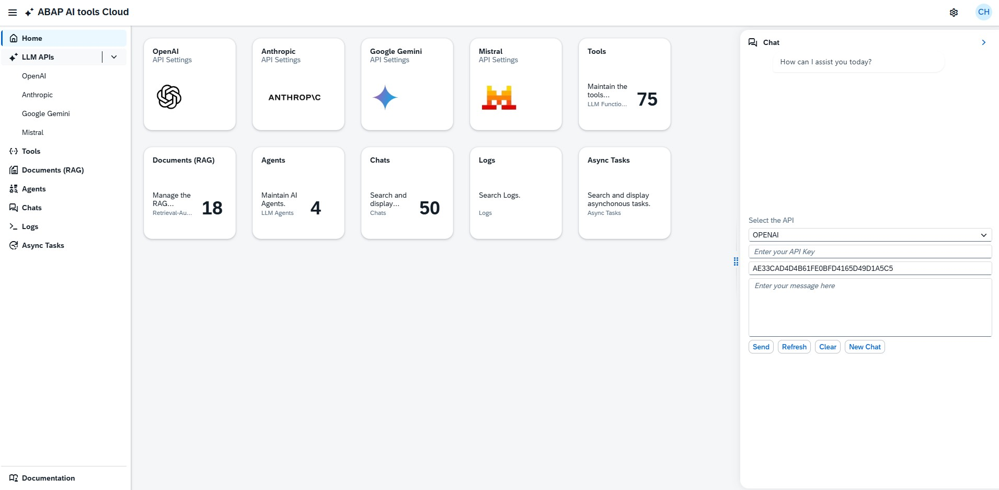
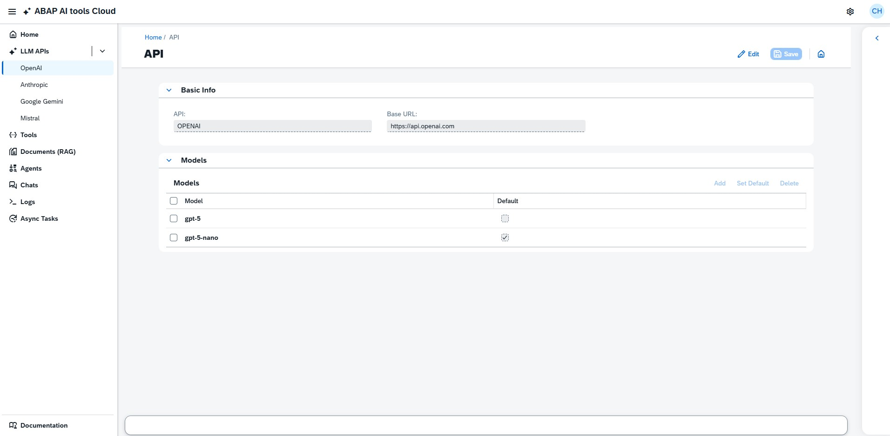
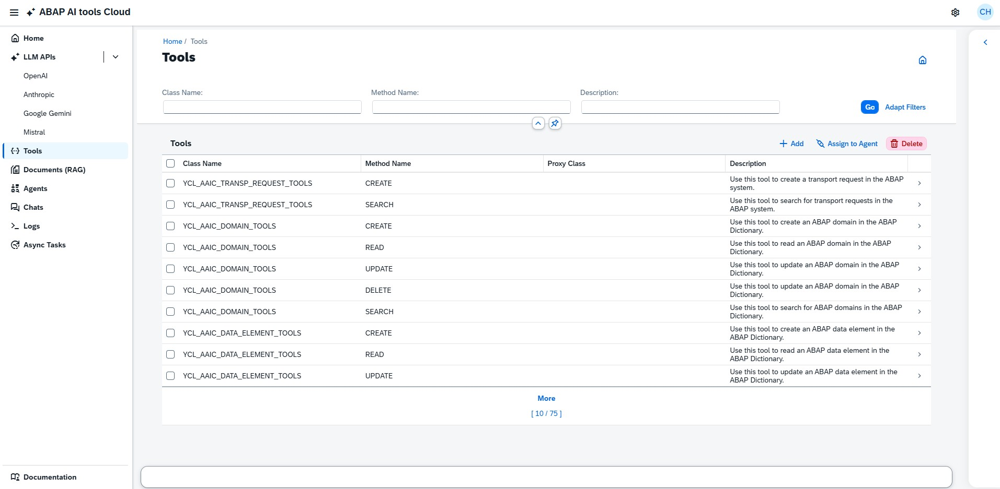
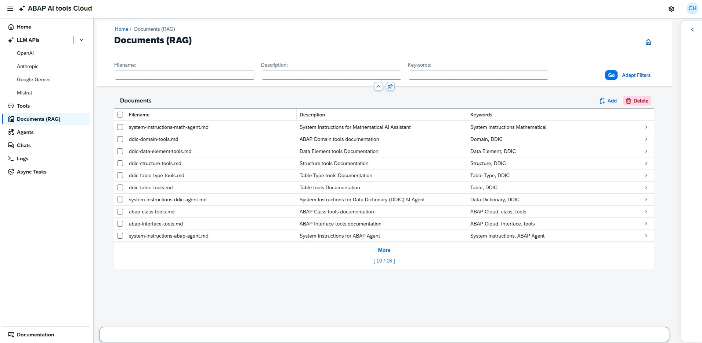
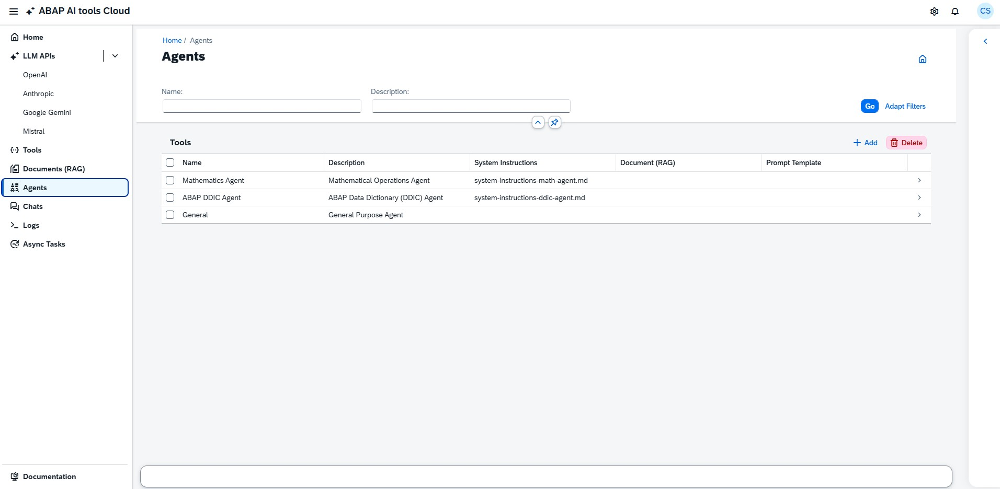
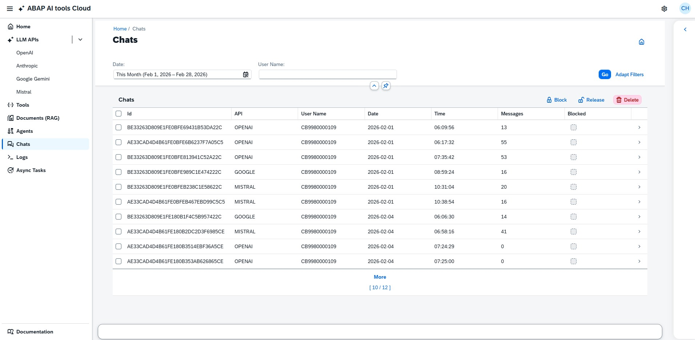
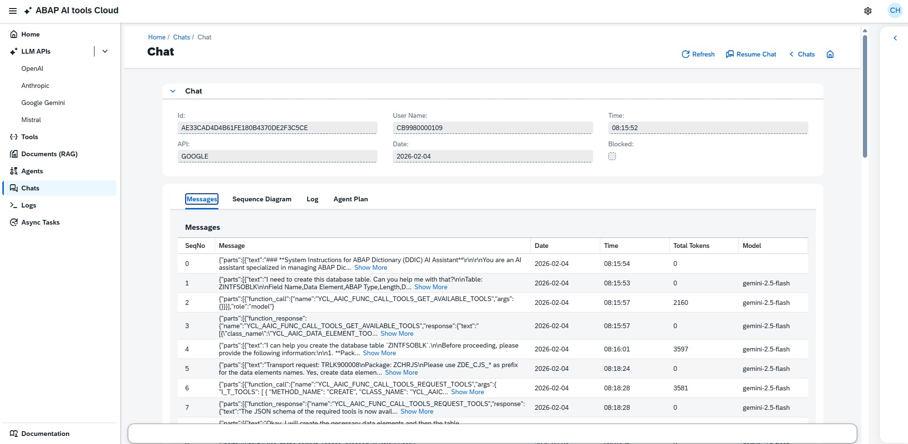
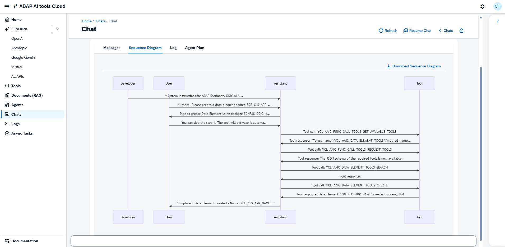
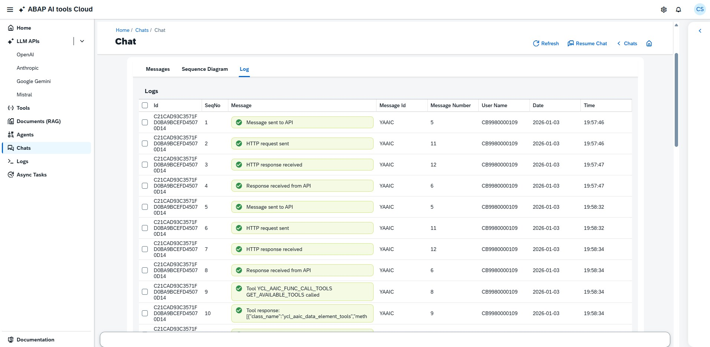
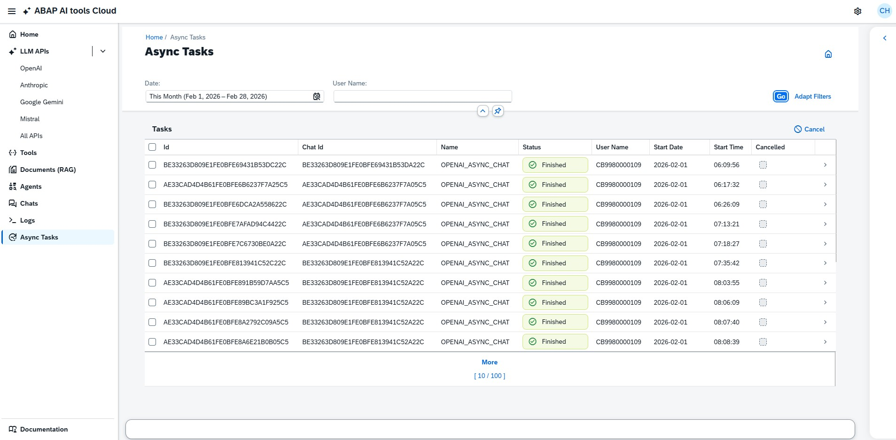

# YAAI Cloud Cockpit

**ABAP AI Tools Cloud Cockpit**

The ABAP AI Tools Cloud Cockpit is a frontend tool designed to streamline the creation and management of AI Agents using the ABAP AI Tools Cloud.

---

## Features

### LLM APIs

Configure the Base URL of the API, register available LLM models, and set the default LLM model.

**Supported APIs:**
- OpenAI
- Anthropic
- Google Gemini
- Mistral

**Example:** Open AI API Settings

---

### Tools

Configure the tools available in the system. These tools are used by AI Agents to perform tasks via Function Calling (also known as Tool Calling). In ABAP AI Tools Cloud, these tools are instance methods of ABAP classes.

For each tool, you can define:
- **Class name**
- **Method name**
- **Proxy class name** (used when a type cast is necessary)
- **Tool description**

---

### Documents (RAG)

Upload markdown documents to be used in AI Agents' system instructions or for Retrieval Augmented Generation (RAG), providing context that the LLM model may lack.

For each document, you can set:
- **File name**
- **Description** of the file content
- **Keywords** to help search documents
- **File content** (must be a markdown `.md` file)

---

### Agents

Set up AI Agents with the following options:
- Assign a markdown document containing system instructions
- Assign a markdown document with information not available in the model's training data (RAG)
- Assign tools for the agent to use
- Set parameters such as LLM API, LLM model, model temperature, etc.

---

### Chats

Access all information about a chat, including:
- Messages exchanged between the user and the LLM model
- Tools called and their responses
- Sequence Diagram view to visualize message flow and tool usage during task execution
- All logs related to the chat
- Option to resume and continue the conversation from where it stopped

**Chat Details**

Messages

Messages Sequence Diagram

Chat Log

---

### Logs

Access all logged messages in the system.

---

### Async Tasks

All chats and tasks executed by AI Agents run as asynchronous processes. In this section, you can view information about these async tasks, such as:
- Task status
- Start date and time
- End date and time

---

